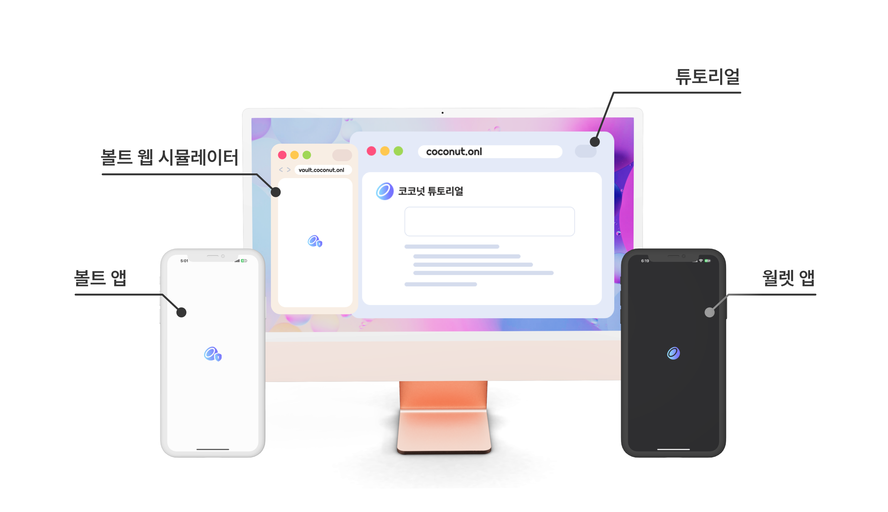

# 코코넛 볼트 ・ Coconut Vault

[](https://github.com/noncelab)
[](https://github.com/noncelab/coconut_vault)
[](https://github.com/noncelab/coconut_vault/blob/main/LICENSE)

[]()
[](https://apps.apple.com/app/id6651839033)
[](https://play.google.com/store/apps/details?id=onl.coconut.vault.regtest)

코코넛 볼트는 에어갭 환경에서 동작하는 콜드 월렛으로, 니모닉 문구를 안전하게 관리하고 트랜잭션에 서명을 해요. 

볼트는 "데이터, 와이파이, 블루투스" 등의 네트워크에 연결되어 있거나 개발자 모드가 켜져있을 때는 동작하지 않아요.

비트코인 전송을 연습하기 위해서는 [코코넛 월렛](https://github.com/noncelab/coconut_wallet)을 다른 휴대폰에 설치하고 [튜토리얼](https://noncelab.gitbook.io/coconut.onl) 사이트를 참고해서 차례로 진행해주세요.

<br/>



<br/>

비트코인 지갑 개발을 위한 라이브러리로 [코코넛 라이브러리](https://pub.dartlang.org/packages/coconut_lib)를 사용하고 있어요.

| coconut_lib         | [](https://pub.dartlang.org/packages/coconut_lib)                 |
| ---------------- | ------------------------------------------------------------------------------------------------------------------------------------------------- |
| coconut_vault | [](https://github.com/noncelab/coconut_vault) |
| coconut_wallet | [](https://github.com/noncelab/coconut_wallet) |

<br/>

## 개발환경 설정 및 실행

### 개발환경 설정

1. 이 프로젝트는 Flutter로 만들어졌습니다.
코드를 통해 앱을 실행하기 위해서는 컴퓨터에 [Flutter 개발환경](https://docs.flutter.dev/get-started/install)이 반드시 갖추어져 있어야 합니다.

2. 버전 확인
    ```bash
    flutter --version
    ```

    ```bash
    # 스토어에 배포된 버전입니다.
    Flutter 3.29.1 • channel stable • https://github.com/flutter/flutter.git
    Framework • revision 09de023485 (11 months ago) • 2025-02-28 13:44:05 -0800
    Engine • revision 871f65ac1b
    Tools • Dart 3.7.0 • DevTools 2.42.2

3. 자동 생성 파일 준비

   ```bash
      dart pub run build_runner clean && dart pub run build_runner build --delete-conflicting-outputs && dart pub run slang
   ```
4. Kotlin 파일 포맷팅 방법 (VSCode or VScode ext IDE like cursor, windsurf)
   - vscode extension: ktfmtter 설치
   - 터미널에 ```/usr/libexec/java_home``` 명령어로 java path 얻기
   - .vscode/settings.json에 아래 내용 추가 (.vscode/settings.sample.json파일 생성 후 로컬에서 관리 추천)
   ```
   "java.configuration.runtimes": [
        {
            "name": "JavaSE-18", // 사용중인 java 버전 이름 입력
            "path": [위에서 명령어로 얻은 java home path 입력],
            "default": true
        }
    ],
    "ktfmtter.ktfmtVersion": "0.47",
    "ktfmtter.style": "google",
    "[kotlin]": {
        "editor.defaultFormatter": "shape-app.ktfmtter"
    }
   ```
   - Kotling 파일에서 ```Shift+Option+F``` 단축키로 포맷팅 / 위 설정은 ‼️커밋 금지‼️


### 실행하기

1. 앱을 실행할 모바일 기기 또는 시뮬레이터 준비하기

2. 소스코드 다운로드
   ```bash
   git clone https://github.com/noncelab/coconut_vault.git
   cd coconut_vault
   ```

3. 플러터 플러그인 설치
   ```bash
   flutter pub get
   ```

4. IDE debug mode 실행시 Default flavor 설정
    * Android Studio or IntelliJ 
        *  Run -> Edit Configurations... -> Build Flavor에 regtest 입력
    * Visual Studio Code
        * .vscode/launch.json 내부에 args 항목을 추가합니다.
          ```json
          {
            "name": "coconut_vault (debug)",
            "request": "launch",
            "type": "dart",
            "args": ["--flavor", "regtest"]
          }
          ```

5. 로컬 키스토어(Keystore) 설정

   `android/app/build.gradle` 설정에 의해, 앱을 실행하려면 각 환경(flavor)에 맞는 속성 파일(`key_*.properties`)이 반드시 존재해야 합니다.
   
   로컬 개발 환경에서는 환경 설정을 위해 임의로 생성한 키스토어(`local.jks`)를 생성하여 설정합니다.

   **키스토어 생성하기**
   터미널에서 프로젝트 최상위 경로(root)로 이동 후 아래 명령어를 실행하여 `android/app/local.jks` 파일을 생성합니다.
   
   ```bash
   keytool -genkey -v -keystore android/app/local.jks -storepass android -alias local -keypass android -keyalg RSA -keysize 2048 -validity 10000 -dname "CN=Local Dev,O=Coconut,C=KR"
   ```

   **속성 파일(Properties) 생성하기**
   android/ 폴더 아래에 key_regtest.properties와 key_mainnet.properties 파일을 각각 생성하고, 아래 내용을 똑같이 작성합니다.

   ```key_*.properties
   storePassword=android
   keyPassword=android
   keyAlias=local
   storeFile=../app/local.jks
   ```

6. 터미널 실행 가이드
    ```bash
    # debug mode
    flutter run --flavor regtest

    # release mode
    flutter run --release --flavor regtest
    ```

    **디버깅 모드로 실행하려면 휴대폰 개발자 모드를 끌 수 없어요❗**

    debug mode로 실행시에는 네트워크와 블루투스 연결이 해제되었는지만 검사하고, 개발자 모드가 켜져있는 것은 검사하지 않도록 구현해놨습니다. 

    하지만 release mode로 실행시에는 휴대폰의 개발자 모드까지 꺼져있어야만 사용이 가능합니다.

    <br />

    **flavor 옵션은 왜 설정해야 하나요❓**
          
    코코넛 볼트는 용도에 따라 두 가지 버전을 제공합니다.

    mainnet: 실제 비트코인 메인넷을 사용하는 정식 출시 버전입니다. 스토어를 통해 유료로 제공되며, 실제 자산을 관리할 때 사용합니다.

    regtest: 로컬 테스트넷 환경을 사용하는 학습용 버전입니다. 코코넛 월렛과 연동하여 가상의 비트코인으로 전송 과정을 무료로 연습해볼 수 있습니다.

     **⚠️ Mainnet 임의 빌드 시 주의사항**

    공식 배포 채널(앱스토어/플레이스토어)이 아닌 방법으로 소스 코드를 직접 빌드하여 Mainnet 환경에서 사용하는 경우, 발생할 수 있는 자산 손실이나 오류에 대해 회사는 일체 책임을 지지 않습니다. 개발 및 학습 목적으로는 반드시 `regtest` 모드를 사용해 주세요.

<br/>

## 기여하기

자세한 사항은 [CONTRIBUTING](https://github.com/noncelab/coconut_vault/blob/main/CONTRIBUTING.md)을 참고해주세요.

* [Issues](https://github.com/noncelab/coconut_vault/issues)를 통해 버그를 보고하기
* [Pull Request](https://github.com/noncelab/coconut_vault/pulls)를 통해
    * 새로운 기능을 추가하기
    * 문서를 업데이트하거나 예제를 추가하기
    * 오타나 문법 오류를 수정하기

<br/>

## 라이선스
X11 Consortium License (MIT와 같고 저작권자 이름을 홍보에 사용할 수 없다는 제약이 추가된 라이선스입니다.)

자세한 사항은 [LICENSE](https://github.com/noncelab/coconut_vault/blob/main/LICENSE)를 참고해주세요.

### Dependencies
사용하는 라이브러리들은 MIT, BSD, Apache 중 하나의 라이선스로 설정되어 있으며 상세 내용은 [이 링크](https://github.com/noncelab/coconut_vault/blob/main/lib/oss_licenses.dart)를 참고해주세요.