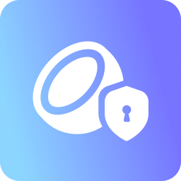

# Coconut Vault

[](https://github.com/noncelab/coconut_vault)
[](https://github.com/noncelab/coconut_vault/blob/main/LICENSE)
[](https://flutter.dev)
[](https://github.com/noncelab/coconut_vault)

<p align="center">
  
</p>
<p align="center">
  <a href="https://apps.apple.com/kr/app/%EC%BD%94%EC%BD%94%EB%84%9B-%EB%B3%BC%ED%8A%B8/id6745778502"></a>&nbsp;&nbsp;
  <a href="https://play.google.com/store/apps/details?id=onl.coconut.vault.mainnet"></a>
</p>

**Offline Bitcoin Signer for iOS & Android**

> **Try it risk-free!** A **regtest version** is available on both app stores, allowing you to practice air-gapped transactions with test bitcoin — no real funds required.  
> [App Store](https://apps.apple.com/app/id6651839033) · [Google Play](https://play.google.com/store/apps/details?id=onl.coconut.vault.regtest)

---

**Coconut Vault** is an offline signer that runs only when the device is disconnected from networks. You can use keys in **signing-only mode** or **secure storage mode**. The app **does not run** when the device is connected to any network (Wi‑Fi, cellular, Bluetooth) or when developer mode is enabled.

## Features

- **Wallet creation** — Create and restore Bitcoin wallets; no limit on how many you can have
- **Mode selection** — Use **secure storage mode** or **signing-only mode** depending on how you want to manage keys
- **Secure key storage** — Use the device Secure Module (e.g. Secure Enclave, Strong Box) for stronger key protection
- **Multisig made simple** — Multisig wallet support with a focus on usability
  - **Supported hardware wallets** - Keystone 3 Pro, Seedsigner, Jade, Coldcard, Krux
- **Signing** — Sign transactions offline; keys never leave the device
- **Connection guard** — Detects external connectivity and immediately blocks use
- **Risk detection** — Detects rooting (Android) and jailbreak (iOS) and warns you; you can still choose to continue

To practice sending bitcoin, install [Coconut Wallet](https://github.com/noncelab/coconut_wallet) on another device and follow the [tutorial](https://tutorial.coconut.onl) to complete the flow step by step.

## Architecture

```
      OFFLINE                                        ONLINE
┌─────────────────┐          QR Code         ┌─────────────────┐
│  Coconut Vault  │ ◄──────────────────────► │ Coconut Wallet  │
│                 │                          │                 │
│  · Key storage  │                          │  · Balance sync │
│  · Tx signing   │                          │  · Tx creation  │
│                 │                          │  · Broadcasting │
└─────────────────┘                          └─────────────────┘
```

The vault stays offline; private keys never leave the device. Signed transactions are passed via QR codes to the wallet for broadcasting.

## Coconut Projects

| Project | Description |
|---------|-------------|
| [coconut_lib](https://pub.dartlang.org/packages/coconut_lib) | [](https://pub.dartlang.org/packages/coconut_lib) — Bitcoin wallet development library |
| [coconut_vault](https://github.com/noncelab/coconut_vault) | [](https://github.com/noncelab/coconut_vault) — Offline signer |
| [coconut_wallet](https://github.com/noncelab/coconut_wallet) | [](https://github.com/noncelab/coconut_wallet) — Watch-only wallet |
| [coconut_design_system](https://github.com/noncelab/coconut_design_system) | [](https://github.com/noncelab/coconut_design_system) — Design System |

## Build & Run

### Prerequisites

- [Flutter SDK](https://docs.flutter.dev/get-started/install) (3.29+)
- Dart 3.7+
- Android Studio or Xcode

```bash
flutter --version
```

### Clone & Install Dependencies

```bash
git clone https://github.com/noncelab/coconut_vault.git
cd coconut_vault
flutter pub get
```

### Code Generation

```bash
dart run build_runner clean && dart run build_runner build --delete-conflicting-outputs && dart run slang
```

### Android Keystore Setup

Generate a local keystore for Android builds:

```bash
keytool -genkey -v -keystore android/app/local.jks \
  -storepass android -alias local -keypass android \
  -keyalg RSA -keysize 2048 -validity 10000 \
  -dname "CN=Local Dev,O=Coconut,C=KR"
```

Create `key_regtest.properties` and `key_mainnet.properties` under the `android/` directory:

```properties
storePassword=android
keyPassword=android
keyAlias=local
storeFile=../app/local.jks
```

### Run

```bash
# Debug
flutter run --flavor regtest

# Release
flutter run --release --flavor regtest
```

**Debug mode** only checks that network and Bluetooth are disabled; **release mode** also requires developer options to be turned off on the device.

### Flavors

| Flavor | Description |
|--------|-------------|
| `mainnet` | Real Bitcoin mainnet — production release distributed via app stores |
| `regtest` | Local testnet — for learning and development with [Coconut Wallet](https://github.com/noncelab/coconut_wallet) |

### IDE Configuration

**Android Studio / IntelliJ**

Run → Edit Configurations... → Set Build Flavor to `regtest`

**VS Code** — `.vscode/launch.json`:

```json
{
  "name": "coconut_vault (debug)",
  "request": "launch",
  "type": "dart",
  "args": ["--flavor", "regtest"]
}
```

> **⚠️ Mainnet Self-Build Disclaimer**: If you build and run the app from source on mainnet outside of official distribution channels (App Store / Google Play), we assume no responsibility for any loss of funds or errors that may occur. Please use `regtest` mode for development and testing.

## Contributing

Please refer to [CONTRIBUTING.md](https://github.com/noncelab/coconut_vault/blob/main/CONTRIBUTING.md) for details.

- [Issues](https://github.com/noncelab/coconut_vault/issues) — Bug reports and feature requests
- [Pull Requests](https://github.com/noncelab/coconut_vault/pulls) — New features, documentation improvements, and bug fixes

## Responsible Disclosure

If you discover a critical security vulnerability, please report it directly to [hello@noncelab.com](mailto:hello@noncelab.com) instead of opening a public issue.

## License

X11 Consortium License (identical to MIT, with an additional restriction that the copyright holder's name may not be used for promotional purposes).

See [LICENSE](https://github.com/noncelab/coconut_vault/blob/main/LICENSE) for details.

### Dependencies

All third-party libraries used in this project are licensed under MIT, BSD, or Apache. See the [full list](https://github.com/noncelab/coconut_vault/blob/main/lib/oss_licenses.dart) for details.

## Community & Links

| | |
|---|---|
| **Website** | [coconut.onl](https://coconut.onl) / [powbitcoiner.com](https://powbitcoiner.com) |
| **X (Twitter)** | [@CoconutWallet 🌐](https://x.com/CoconutWallet) / [@Coconut 🇰🇷](https://x.com/Coconut_BTC) |
| **Discord** | [Join our Discord](https://discord.gg/VjZxYaQCRj) |
| **Documentation** | [Tutorials & Docs](https://tutorial.coconut.onl) |
| **GitHub** | [github.com/noncelab](https://github.com/noncelab) |
| **Company Site** | [NonceLab](https://noncelab.com) |

</br>
