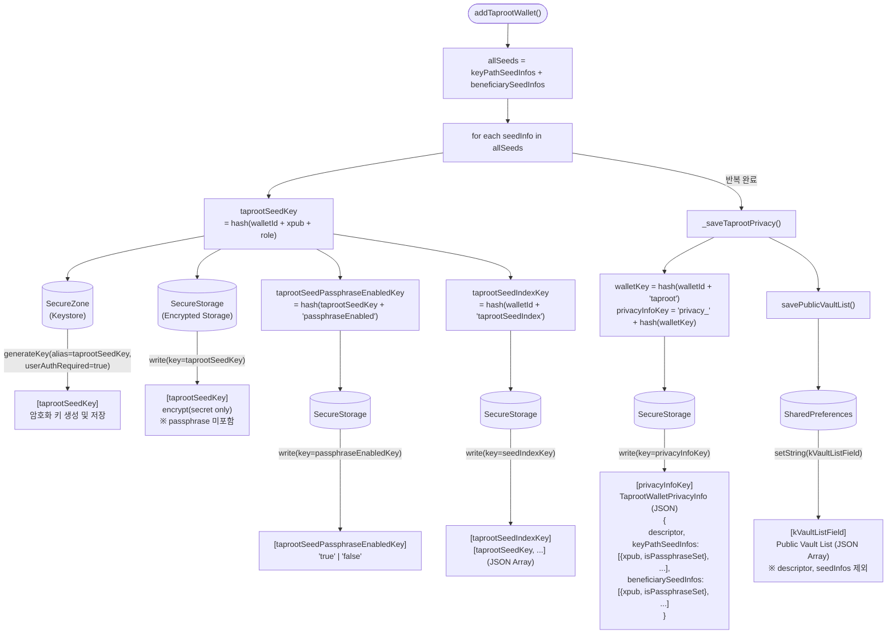
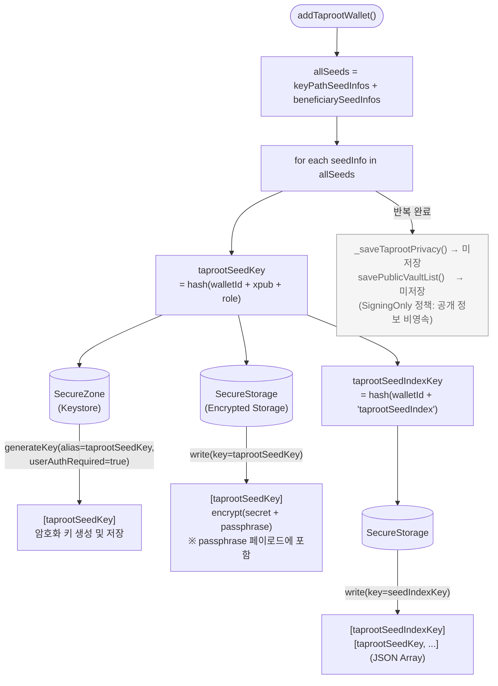

# Taproot 지갑 추가 시 저장 데이터 구조

> `addTaprootWallet(TaprootWalletCreateDto)` 호출 시 모드별로 저장되는 데이터와 키 생성 방식을 도식화한 문서입니다.

---

## 키 생성 규칙 (WalletStorageKeys)

```
taprootSeedKey       = hash("${walletId} - ${seedInfo.extendedPublicKey} - ${seedInfo.role.name}")
                         role.name = "keyPath" | "beneficiary"

taprootSeedPassphraseEnabledKey = hash("${taprootSeedKey} - passphraseEnabled")

taprootSeedIndexKey  = hash("${walletId} - taprootSeedIndex")

walletKey            = hash("${walletId} - taproot")
privacyInfoKey       = "privacy_" + hash(walletKey)
```

---

## 1. SecureStorage 모드



---

## 2. SigningOnly 모드



---

## 모드별 저장 항목 비교

| 저장소 | 키 | 값 | SecureStorage | SigningOnly |
|---|---|---|:---:|:---:|
| **SecureZone** | `taprootSeedKey` | 암호화 키 (Keystore alias) | O | O |
| **SecureStorage** | `taprootSeedKey` | `encrypt(secret)` | O | O |
| **SecureStorage** | `taprootSeedKey` (payload) | passphrase 포함 여부 | 미포함 | **포함** |
| **SecureStorage** | `taprootSeedPassphraseEnabledKey` | `"true"` \| `"false"` | O | **X** |
| **SecureStorage** | `taprootSeedIndexKey` | seed key 목록 `[...]` | O | O |
| **SecureStorage** | `privacyInfoKey` | `TaprootWalletPrivacyInfo` JSON | O | **X** |
| **SharedPreferences** | `kVaultListField` | Public vault list JSON | O | **X** |

### 핵심 차이점

- **SecureStorage 모드**: passphrase는 암호화 페이로드에 포함하지 않고, 별도의 `passphraseEnabledKey`로 플래그만 저장. Privacy info와 Public vault list를 모두 영속.
- **SigningOnly 모드**: passphrase를 암호화 페이로드(secret) 내에 함께 포함하여 저장. `passphraseEnabledKey` 미저장. Privacy info 및 Public vault list 영속하지 않음.

---

## 저장 데이터 상세

### SecureZone (taprootSeedKey)
시스템 Keystore에 AES 암호화 키를 생성. `userAuthRequired=true`로 생기기 때문에 생체 인증 또는 PIN 인증 후에만 사용 가능.

### SecureStorage (taprootSeedKey)
`SecureZonePayloadCodec.buildPlaintext()`로 구성된 페이로드를 SecureZone 키로 암호화한 결과(`toCombinedBase64()`)를 저장.

| 모드 | 페이로드 구성 |
|---|---|
| SecureStorage | `{ secret: Uint8List }` |
| SigningOnly | `{ secret: Uint8List, passphrase: Uint8List? }` |

### SecureStorage (privacyInfoKey) — SecureStorage 모드 전용

```json
{
  "descriptor": "tr(...)",
  "keyPathSeedInfos": [
    { "extendedPublicKey": "xpub...", "isPassphraseSet": true }
  ],
  "beneficiarySeedInfos": [
    { "extendedPublicKey": "xpub...", "isPassphraseSet": false }
  ]
}
```
