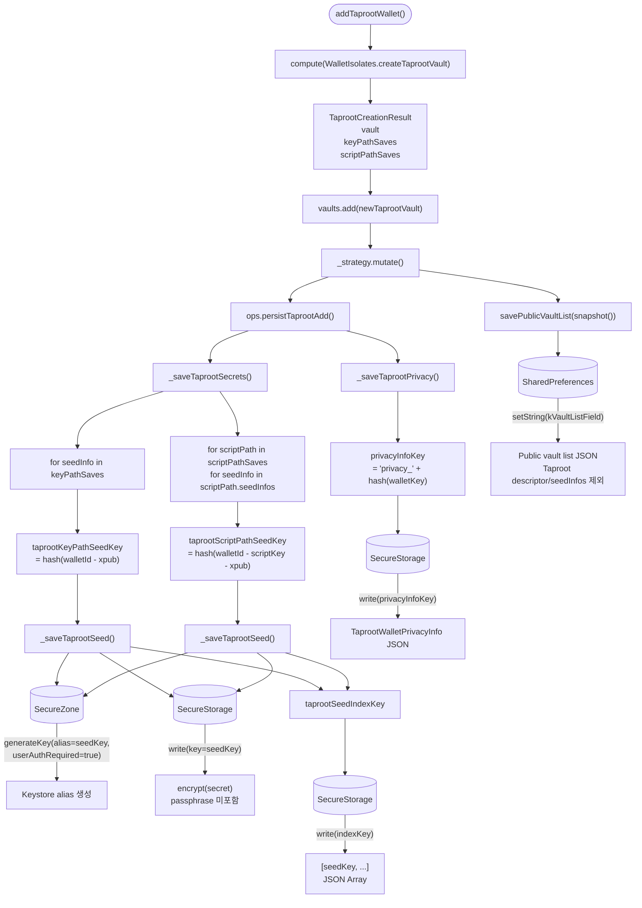
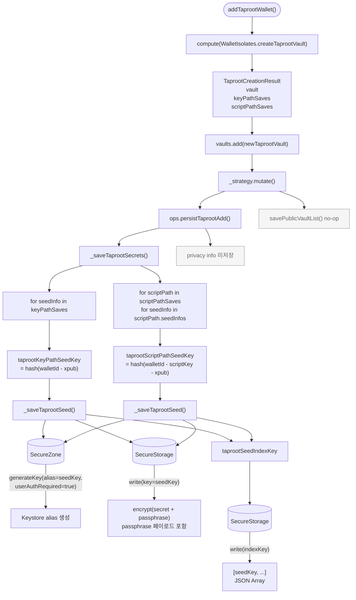

# Taproot 지갑 추가 시 저장 데이터 구조

> `WalletRepository.addTaprootWallet(TaprootWalletCreateDto)` 호출 시 현재 구현 기준으로 저장되는 데이터와 키 생성 방식을 정리한 문서입니다.

---

## 관련 구현 위치

- `WalletRepository.addTaprootWallet()`
- `WalletPersistenceStrategy.mutate()`
- `WalletWriteOps.persistTaprootAdd()`
- `SecureStorageStrategy._saveTaprootSecrets()`
- `SecureStorageStrategy._saveTaprootPrivacy()`
- `SigningOnlyStrategy._saveTaprootSecrets()`
- `WalletStorageKeys`

---

## 키 생성 규칙

```dart
// WalletStorageKeys
taprootKeyPathSeedKey(walletId, extendedPublicKey)
  = hash("$walletId - $extendedPublicKey")

taprootScriptPathSeedKey(walletId, scriptKey, extendedPublicKey)
  = hash("$walletId - $scriptKey - $extendedPublicKey")

taprootSeedKey(walletId, identifier)
  = KeyPathSeedKeyIdentifier
      ? taprootKeyPathSeedKey(walletId, extendedPublicKey)
      : taprootScriptPathSeedKey(walletId, scriptKey, extendedPublicKey)

taprootSeedIndexKey(walletId)
  = hash("$walletId - taprootSeedIndex")

walletKey(walletId, WalletType.taproot)
  = hash("$walletId - taproot")

privacyInfoKey(walletKey)
  = "privacy_" + hash(walletKey)
```

현재 Taproot seed에는 별도 `passphraseEnabledKey`를 저장하지 않습니다.
PrivacyInfo로 secure storage 영역에 저장하는 TaprootSeedInfo, ScriptPathSeedInfo에 isPassphraseSet 필드로 대신 관리합니다.

---

## 저장 대상 seed 구분

Taproot 지갑 생성 isolate는 다음 데이터를 반환합니다.

```dart
typedef TaprootCreationResult = ({
  TaprootVaultListItem vault,
  List<TaprootSeedInfoForSave> keyPathSaves,
  List<ScriptPathSeedInfoForSave> scriptPathSaves,
});
```

저장되는 seed는 두 종류입니다.

| 종류 | 저장 키 |
|---|---|
| Key path seed | `taprootKeyPathSeedKey(walletId, extendedPublicKey)` |
| Script path seed | `taprootScriptPathSeedKey(walletId, scriptPath.key, extendedPublicKey)` |

모든 seed key는 저장 후 `taprootSeedIndexKey(walletId)`에 JSON 배열로 누적됩니다.

---

## 1. SecureStorage 모드



### SecureStorage 모드 저장 순서

1. `addTaprootWallet()`에서 `TaprootCreationResult` 생성
2. 메모리의 `vaults`에 `TaprootVaultListItem` 추가
3. `SecureStorageStrategy.mutate()` 실행
4. `persistTaprootAdd()`에서 seed 저장
5. seed 저장 성공 후 privacy info 저장
6. `mutate()`가 마지막에 public vault list 저장

`_saveTaprootPrivacy()` 실패 시, 방금 저장한 Taproot seed들을 삭제한 뒤 예외를 다시 던집니다.

---

## 2. SigningOnly 모드



SigningOnly 모드는 공개 vault list와 privacy info를 디스크에 영속하지 않습니다.

---

## 모드별 저장 항목 비교

| 저장소 | 키 | 값 | SecureStorage | SigningOnly |
|---|---|---|:---:|:---:|
| **SecureZone** | `taprootKeyPathSeedKey` | Key path seed 암호화 키 alias | O | O |
| **SecureZone** | `taprootScriptPathSeedKey` | Script path seed 암호화 키 alias | O | O |
| **SecureStorage** | `taprootKeyPathSeedKey` | 암호화된 key path seed payload | O | O |
| **SecureStorage** | `taprootScriptPathSeedKey` | 암호화된 script path seed payload | O | O |
| **SecureStorage** | seed payload | passphrase 포함 여부 | 미포함 | **포함** |
| **SecureStorage** | `taprootSeedIndexKey` | seed key 목록 JSON 배열 | O | O |
| **SecureStorage** | `passphraseEnabledKey` | Taproot에서는 미사용 | X | X |
| **SecureStorage** | `privacyInfoKey` | `TaprootWalletPrivacyInfo` JSON | O | X |
| **SharedPreferences** | `kVaultListField` | Public vault list JSON | O | X |

### 핵심 차이점

- **SecureStorage 모드**: Taproot seed payload에는 passphrase를 포함하지 않습니다. `TaprootWalletPrivacyInfo`와 public vault list를 영속합니다.
- **SigningOnly 모드**: Taproot seed payload에 passphrase를 함께 포함합니다. Privacy info와 public vault list는 영속하지 않습니다.
- **Taproot passphrase flag**: 현재 Taproot seed에 대해 별도 `passphraseEnabledKey`는 저장하지 않습니다.

---

## 저장 데이터 상세

### SecureZone

각 Taproot seed key를 alias로 사용해 시스템 Keystore에 암호화 키를 생성합니다.

```dart
generateKey(alias: seedKey, userAuthRequired: true)
```

따라서 복호화 시 생체 인증 또는 PIN 인증이 필요합니다.

### SecureStorage seed payload

`SecureZonePayloadCodec.buildPlaintext()`로 구성한 payload를 SecureZone 키로 암호화한 결과(`toCombinedBase64()`)를 저장합니다.

| 모드 | payload 구성 |
|---|---|
| SecureStorage | `{ secret: Uint8List, passphrase: null }` |
| SigningOnly | `{ secret: Uint8List, passphrase: Uint8List? }` |

### SecureStorage `taprootSeedIndexKey`

Taproot 지갑은 seed가 여러 개일 수 있으므로 삭제/정리 시 사용할 seed key 목록을 별도로 저장합니다.

```json
[
  "keyPathSeedKeyHash",
  "scriptPathSeedKeyHash"
]
```

### SecureStorage `privacyInfoKey` — SecureStorage 모드 전용

`TaprootWalletPrivacyInfo`가 JSON으로 저장됩니다.

```json
{
  "descriptor": "tr(...)",
  "keyPathSeedInfos": [
    {
      "extendedPublicKey": "xpub...",
      "isPassphraseSet": true
    }
  ],
  "scriptPathSeedInfos": [
    {
      "key": "scriptPathKeyHash",
      "role": "beneficiary",
      "seedInfos": [
        {
          "extendedPublicKey": "xpub...",
          "isPassphraseSet": false
        }
      ]
    }
  ]
}
```

### SharedPreferences `kVaultListField` — SecureStorage 모드 전용

`TaprootVaultListItem.toPublicJson()` 결과가 public vault list에 포함됩니다.

Public JSON에서는 다음 필드가 제거됩니다.

- `descriptor`
- `keyPathSeedInfos`
- `scriptPathSeedInfos`

---

## 삭제 및 롤백

### 지갑 삭제

`deleteWallet()` 또는 `deleteWallets()`는 `ops.deleteWalletData(id, WalletType.taproot)`를 통해 Taproot 데이터를 삭제합니다.

SecureStorage 모드에서는 다음이 삭제됩니다.

- `taprootSeedIndexKey`에 기록된 모든 seed payload
- 각 seed payload의 SecureZone alias
- `taprootSeedIndexKey`
- `privacyInfoKey`

SigningOnly 모드에서는 다음이 삭제됩니다.

- `taprootSeedIndexKey`에 기록된 모든 seed payload
- 각 seed payload의 SecureZone alias
- `taprootSeedIndexKey`

### 추가 실패 롤백

`addTaprootWallet()` 중 저장 실패가 발생하면 메모리의 마지막 vault를 제거하고 `deleteWalletData(nextId, WalletType.taproot)`로 부분 저장 데이터를 정리합니다.

`SecureStorageStrategy.persistTaprootAdd()`에서는 seed 저장 후 privacy info 저장에 실패하면, 방금 저장한 seed key 목록을 계산해 seed payload와 SecureZone alias를 삭제합니다.

---

## SigningOnly → SecureStorage 전환

`WalletRepository.updateIsSigningOnlyMode(false)` 호출 시 `_changeToSecureStorageMode()`가 실행됩니다.

Taproot 지갑의 경우:

1. `TaprootVaultListItem.keyPathSeedInfos`를 순회
2. `KeyPathSeedKeyIdentifier`로 signing-only seed 복호화
3. `TaprootSeedInfoForSave`로 변환
4. `TaprootVaultListItem.scriptPathSeedInfos`를 순회
5. `ScriptPathSeedKeyIdentifier`로 signing-only seed 복호화
6. `ScriptPathSeedInfoForSave`로 변환
7. `SecureStorageStrategy.persistTaprootAdd()`로 secure-storage 방식 재저장

전환 후 SecureStorage 모드에서는 seed payload에 passphrase가 포함되지 않고, privacy info와 public vault list가 저장됩니다.
